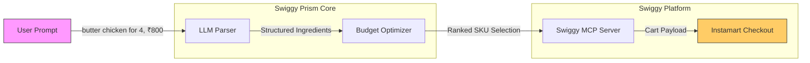

# Swiggy Prism

**AI-Powered Contextual Commerce for Swiggy Instamart**

> Transform any recipe or meal plan into a budget-optimized, nutrition-aware Instamart cart — in seconds.

[](https://deepanshuvermaa.github.io/swiggy-prism/)

**[https://deepanshuvermaa.github.io/swiggy-prism/](https://deepanshuvermaa.github.io/swiggy-prism/)**

---

## Value Proposition

India's middle-class households spend 30-40% of monthly income on food. Swiggy Prism bridges the gap between **meal inspiration** and **smart grocery shopping** by:

- **Eliminating decision fatigue**: Paste a recipe, get a cart — no manual searching.
- **Respecting budgets**: Our Knapsack-based optimizer ensures every rupee counts, prioritizing essential ingredients when budgets are tight.
- **Driving Instamart GMV**: Every interaction converts intent into a checkout-ready cart, increasing basket size and order frequency.

## Architecture



### Flow

1. **User Input** — Natural language recipe or meal plan with optional budget constraint
2. **LLM Parser** (`src/core/parser.ts`) — Extracts structured ingredients, quantities, and units using Gemini/OpenAI
3. **Budget Optimizer** (`src/core/optimizer.ts`) — Maps ingredients to best-value Instamart SKUs using a priority-weighted Knapsack algorithm
4. **MCP Transport** (`src/mcp/`) — Sends optimized cart to Swiggy via Model Context Protocol
5. **Checkout** — User reviews and confirms the pre-built cart

## Tech Stack

| Layer | Technology |
|-------|-----------|
| Runtime | Node.js 20+ / TypeScript 5.x |
| AI/LLM | Google Gemini API / OpenAI GPT-4 |
| Protocol | Model Context Protocol (MCP) via `https://swiggy.deepanshuverma.site` |
| Algorithm | Priority-weighted 0/1 Knapsack |
| Testing | Vitest |
| Linting | ESLint + Prettier |

## Security & Privacy

**Zero PII Retention** — Swiggy Prism processes user prompts ephemerally. No personal data, addresses, or payment information is stored, logged, or transmitted beyond the active session.

- All communication with Swiggy MCP uses **TLS 1.3** encrypted transport
- OAuth 2.0 token flow for Swiggy API authentication — tokens are never persisted to disk
- No scraping, crawling, or unauthorized data collection from Swiggy's platform
- Strict compliance with Swiggy's **Sacred Data** ground rules — data is used solely for cart assembly, never resold or repurposed
- See [SECURITY.md](./SECURITY.md) for full security policy

## Phases

### Phase 1 — Core Utility (MVP)
- [x] Recipe-to-Cart LLM parser
- [x] Budget-First Knapsack optimizer
- [x] MCP server integration

### Phase 2 — Retention & Growth
- [x] Multi-source intent — YouTube + Instagram share simulation
- [x] Swiggy Prism "Wrapped" — spending analytics with localStorage persistence
- [x] Health Score — calorie/macro breakdown with nutrition ring
- [x] Persona system — Foodie / Gym Freak / Balanced / Budget Saver
- [x] Personalized recommendations based on persona + order history

## Quick Start

```bash
# Clone
git clone https://github.com/deepanshuvermaa/swiggy-prism.git
cd swiggy-prism

# Install
npm install

# Configure
cp .env.example .env
# Add your Gemini API key (optional — works without it using local parser)

# Run dev server
npm run dev
# Open http://localhost:3000

# Run tests
npm test
```

Or just try the **[Live Demo](https://deepanshuvermaa.github.io/swiggy-prism/)** — no setup needed.

## License

MIT — see [LICENSE](./LICENSE)

---

*Built by [Deepanshu Verma](https://deepanshuverma.site/portfolio) for the Swiggy Builders Club (MCP)*
